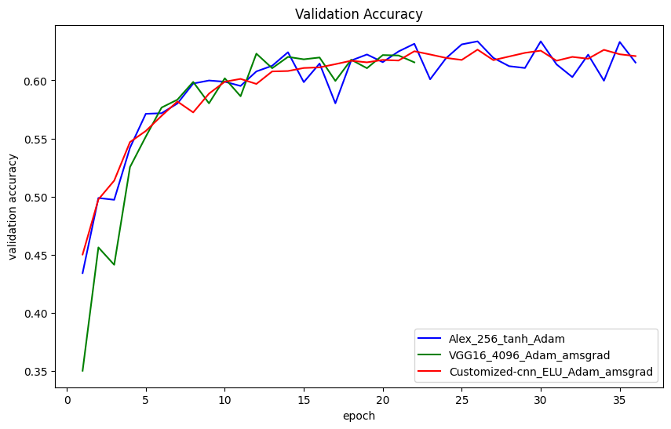
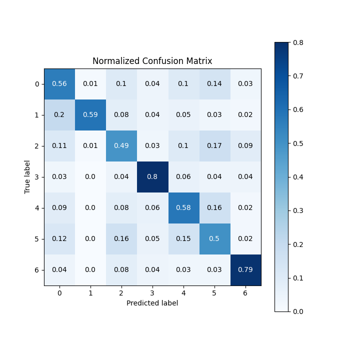
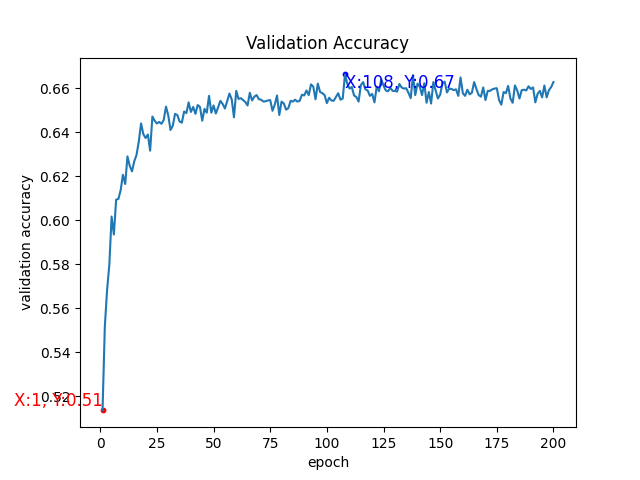
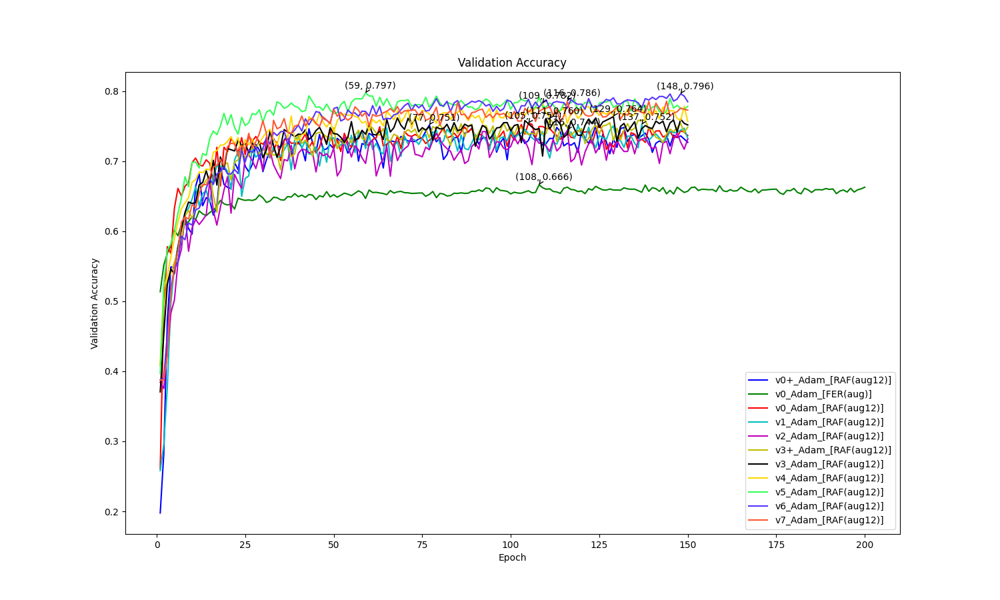
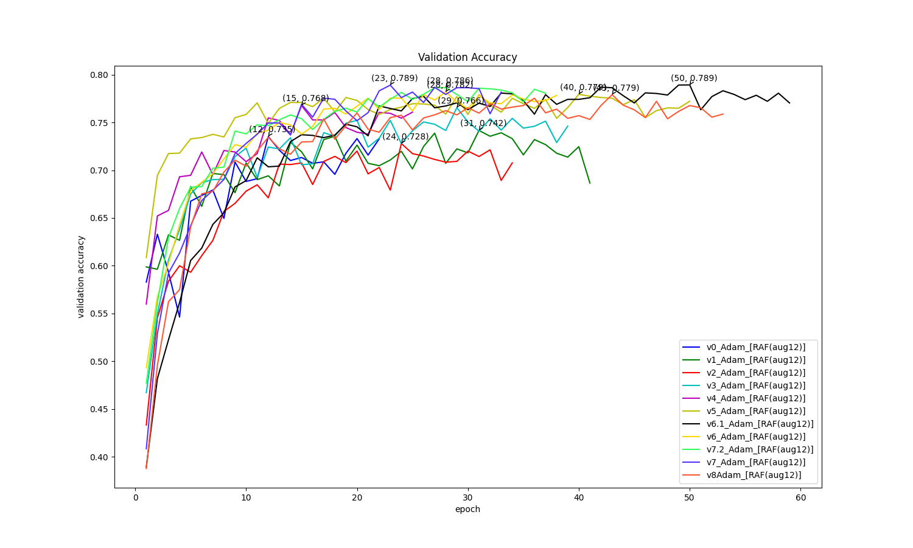

# Group 6 : Emotion Recognition from Facial Expressions
Author: Haohua Feng, PinKuan Hsieh
# Abstract:
The project's objective is to train a CNN (Convolutional Neural Network) model capable of accurately distinguishing human facial expressions. Our target is to achieve a minimum accuracy rate of 80%. The ultimate aim is to implement this model in user interface design and mental health monitoring applications.

# 1. Dataset:
Initially, we utilized the FER-2013 dataset [[1]](https://www.kaggle.com/datasets/msambare/fer2013), a widely recognized collection of facial expressions, which includes both training and testing subsets. Our approach involved training a CNN on the training subset and evaluating its performance using the testing subset. Despite extensive optimization efforts, such as training on various models and applying techniques like adding noise or rotating images, the accuracy remained suboptimal, only 66%. We suspected issues with the dataset itself, as we observed some incorrectly assigned labels within it. Supporting our suspicion, this paper [[2]](https://arxiv.org/pdf/2306.09626v1.pdf) also noted that some samples in FER-2013 are incorrectly labeled or lack a face. Consequently, we switched to the RAF-DB dataset [[3]](http://www.whdeng.cn/raf/model1.html), a more refined dataset with diverse and accurately labeled facial expressions, with which we achieved an accuracy rate above 80%.

For detailed information about the data engineering techniques we applied to our datasets, such as `Weight Adjustment`, `Data Augmentation`, and `Noisy Pepper`, please refer to the "4. Optimization Algorithm" section.

# 2. Model Description:

## For dataset FER-2013, 15 models included:
On the first dataset, FER-2013, we utilized `AlexNet` [[4]](https://proceedings.neurips.cc/paper_files/paper/2012/file/c399862d3b9d6b76c8436e924a68c45b-Paper.pdf), `VGG-16` [[5]](https://arxiv.org/pdf/1409.1556.pdf), and our `customized-CNN`. We adjusted parameters in each model, such as different FC-layer sizes (256 input, 4096 input), different optimizer functions (Adam, SGD), various optimization methods (AMSGrad, weight adjustment), and activation functions (ReLU, Sigmoid, Tanh, ELU). For specifics on the model structures, please refer to our code in `/models/old_models`. We conducted 4 rounds of comparison under this dataset, adhering to specific rules: 

**The comparison rules are primarily based on validation accuracy. If two models exhibit nearly identical validation accuracies, we select the one whose accuracy is more stable across each round.**

### Round 1:
1. Model: AlexNet_256 with Activation Functions in FC (Sigmoid, Tanh, ReLU) and Optimizers (Adam, SGD). Winner selected: Alex_256_ReLU_Adam.
   
2. Model: AlexNet_4096 with Activation Functions in FC (Tanh, ReLU) and Optimizers (Adam, SGD). Winner selected: Alex_4096_ReLU_Adam.

We then compared the winners of AlexNet_4096 and AlexNet_256, selecting the final Round 1 winner: `Alex_256_Tanh_Adam`.

### Round 2:
Model: VGG16_4096 with Optimizers (Adam, Adam_amsgrad). Winner selected: `VGG16_4096_Adam_amsgrad` for its greater stability.

### Round 3:
Model: Customized-CNN with Optimizer (Adam_amsgrad, SGD) and LR Scheduler. Winner selected: `Customized-CNN_ELU_Adam_amsgrad` for requiring fewer epochs to train.

### Round 4 (final round):
Comparison of winners from Rounds 1, 2, and 3, considering "efficiency". The final winner selected: `Alex_256_Tanh_Adam`. Further optimization was then carried out on this model. You can see the validation accuracy graph of round 4 and the confusion matrix of `Alex_256_Tanh_Adam`.

 

 
 

 

The ultimate winner on the FER-2013 dataset is `Alex_256_Tanh_Adam`. Details of each round's comparison can be found in `code/comparison/fer2013`.

The below graph is the model `Alex_256_Tanh_Adam` architecture:
#### todo: upload model architecture graph
Our model consists of four main parts. First, the "features" part, where we utilize BatchNorm2d for data normalization and pooling layers to selectively enhance the data quality. The second part is "avgpool", where AdaptiveAvgPool2d is employed to handle various image sizes, ensuring a uniform output size. The third section, "flatten," reshapes the data to suit the FC(fully connected) layer. Finally, the fourth part, "classifier," comprises several FC layers. Here, we discovered that using the Tanh activation function yields better results.

## For dataset RAF-DB, 22 models included:
The best result on the FER-2013 dataset was only 65% accuracy. Based on insights from [this paper](https://arxiv.org/pdf/2306.09626v1.pdf), we concluded that the dataset might be problematic, leading us to switch our focus to the RAF-DB dataset. We also employed `DCNN` [[6]](https://arxiv.org/ftp/arxiv/papers/2206/2206.09509.pdf) on FER-2013, but the accuracy is still low (0.67). See the graph below.
 

 

Therefore, we turn to RAF-DB. On RAF-DB, we employed two main models: `DCNN` and `Test-CNN`. With these models, we implemented various techniques, including different optimization methods (such as augmentation, noise addition, learning rate scheduling, and weight adjustment), and diverse activation functions (including Adam, SGD, Relu, Sigmoid, Tanh, and ELU). For specifics on the model structures, please refer to our code in `/models/new_models`

We conducted our analysis over two rounds of comparison, adhering to specific rules:

**Our primary criterion for comparison was validation accuracy. In cases where two models showed nearly identical validation accuracies, preference was given to the model with more consistent accuracy across rounds. The confusion matrix was also a key factor; we favored models where all classes were predicted with over 60% accuracy.**

### Round 1:
Model: DCNN (version 0, 0+, 1, 2, 3, 3+, 4, 5, 6, 7). 
Winner selected: `v5_Adam_[RAF(aug12)]`, and the accuracy is 0.797.
 

 
 

 

### Round 2:
Model: Custom_CNN (V0, V1, V2, V3, V4, V5, V6, V6.1, V7, V7.2, V8). 
The winner of Round 2 is `V7_Adam_[RAF(aug12)]`, as it achieved the highest accuracy more quickly than `V6.1_Adam_[RAF(aug12)]`, reaching an accuracy of 0.789.
 

 
 

 

Based on Round 1 and Round 2, we know `DCNN_v5_Adam_[RAF(aug12)]` can perform better. 
The below graph is the model `DCNN_v5_Adam_[RAF(aug12)]` architecture:
#### todo: upload model architecture graph
We named it "aug12" because we noticed that the model struggled to recognize classes 1 (disgust) and 2 (fear). To improve its performance, we applied data augmentation techniques such as flipping, cropping, and rotation specifically on these classes, enhancing the model's ability to accurately identify them.

#### todo: DCNN_v5 explanation.

We further improve this model by using several optimization algorithms:
#### todo:

# 3. Loss Function:
We initially tried `Mean Squared Error Loss` as our loss function. However, the results were not as effective. We guess this is because MSE is typically more suitable for regression tasks where the output is continuous, rather than classification tasks like ours where discrete categories are predicted. CrossEntropyLoss, on the other hand, is better suited for classification problems as it measures the difference between the probability distribution generated by the model and the true distribution of the labels. We then implemented `criterion = nn.CrossEntropyLoss()` and attached `label_smoothing` in `criterion = nn.CrossEntropyLoss(weight=weights_tensor, label_smoothing=0.2).to(device)`. This smoothing technique has helped improve the model's generalization and robustness against overfitting. By preventing the model from becoming excessively confident in its predictions, we enhanced its performance on unseen data.

# 4. Optimization Algorithm:
On the FER-2013 dataset, we employed `AMSGrad` as the optimization method for some models. `AMSGrad` enhances the standard Adam optimizer by maintaining the maximum of past squared gradients. This stabilizes learning rates and potentially improves convergence stability and performance. Additionally, we `adjusted the weights of certain classes` to address imbalances due to varying data volumes among classes. This ensures a more balanced dataset for our training.

For the RAF-DB dataset, we implemented `augmentation techniques such as rotation, vertical_flip, horizontal_flip, crop, shear, and translate`, along with `Noisy Pepper` and `Gaussian Noise` in picture pre-processing. These techniques aim to increase the accuracy of our model by exposing it to a broader spectrum of variations and challenges. This enhances its capability to recognize and classify emotions under varied conditions. We also utilized a `learning rate scheduler` to dynamically adjust the learning rate during training, aiding in finer convergence and potentially higher accuracy by enabling more effective and adaptive learning. Furthermore, we tried `weight adjustment` based on data distribution or the accuracy of the last version (e.g., v1 is based on v0), allowing us to fine-tune the weight of each data class.

# 5. Metrics and Experimental Results:
The experimental results and metrics are already elaborated in the "2. Model Description" section. You can also check the `code/comparison` folder for more experimental results.

When we apply our model to the real world, 
#### todo: show camera predicted results

# 6. Contributions and GitHub:

Haohua Feng (60%): Design the advanced algorithms, Study RAF-DB, Do GPU computation

PinKuan Hsieh (40%): Design the basic algorithms, Compare results, Report

Github public repository: https://github.com/HaohuaFeng/CSE676_project

## TODO: Other details?:
### compare early stop param v.s. non-early stop params, empirical loss v.s. general loss