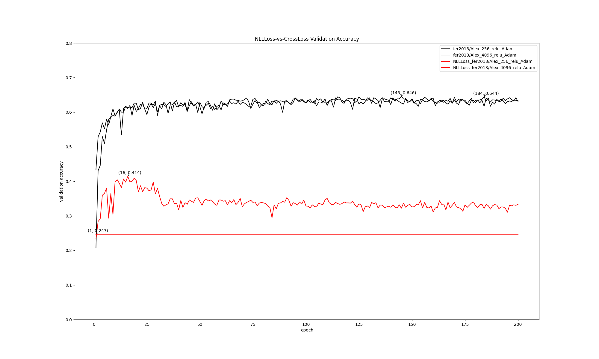

# Group 6 : Emotion Recognition from Facial Expressions

Author: Haohua Feng, PinKuan Hsieh

# Abstract:

The project's objective is to train a CNN (Convolutional Neural Network) model capable of accurately distinguishing human facial expressions. Our target is to achieve a minimum accuracy rate of 80%. The ultimate aim is to implement this model in user interface design and mental health monitoring applications. 

# 1. Dataset:

Initially, we utilized the FER-2013 dataset [[1]](https://www.kaggle.com/datasets/msambare/fer2013), a widely recognized collection of facial expressions, which includes both training and testing subsets. Our approach involved training a CNN on the training subset and evaluating its performance using the testing subset. Despite extensive optimization efforts, such as training on various models and applying techniques like adding noise or rotating images, the accuracy remained suboptimal, only 66%. We suspected issues with the dataset itself, as we observed some incorrectly assigned labels within it. Supporting our suspicion, this paper [[2]](https://arxiv.org/pdf/2306.09626v1.pdf) also noted that some samples in FER-2013 are incorrectly labeled or lack a face. Consequently, we switched to the RAF-DB dataset [[3]](http://www.whdeng.cn/raf/model1.html), a more refined dataset with diverse and accurately labeled facial expressions, with which we achieved an accuracy rate above 80%. Data is not uploaded to github, original files can be download from the hyperlink.

For detailed information about the data engineering techniques we applied to our datasets, such as `Weight Adjustment`, `Data Augmentation`, and `Noisy Pepper`, please refer to the "4. Optimization Algorithm" section.

# 2. Model Description:

## For dataset FER-2013, 14 models included:

On the first dataset, FER-2013, we utilized `AlexNet` [[4]](https://proceedings.neurips.cc/paper_files/paper/2012/file/c399862d3b9d6b76c8436e924a68c45b-Paper.pdf), `VGG-16` [[5]](https://arxiv.org/pdf/1409.1556.pdf), and our `customized-CNN`. We adjusted parameters in each model, such as different FC-layer sizes (256 input, 4096 input), different optimizer functions (Adam, SGD), various optimization methods (AMSGrad, weight adjustment), and activation functions (ReLU, Sigmoid, Tanh, ELU). For specifics on the model structures, please refer to our code in `/models/old_models`. We conducted the comparison under this dataset, adhering to specific rules:

**The comparison rules are primarily based on validation accuracy. If two models exhibit nearly identical validation accuracies, we select the one whose accuracy is more stable across each round.**

### comparison:

Model: AlexNet_256 with Activation Functions in FC (Sigmoid, Tanh, ReLU) and Optimizers (Adam, SGD) vs AlexNet_4096 with Activation Functions in FC (Tanh, ReLU) and Optimizers (Adam, SGD) vs VGG16_4096 with Optimizers (Adam, Adam_amsgrad) vs Customized-CNN with Optimizer (Adam_amsgrad, SGD) and LR Scheduler

The winner is `Alex_256_ReLU_Adam`. The validation accuracy is Further optimization was then carried out on this model. You can see the validation accuracy graph of these 14 models and the confusion matrix of `Alex_256_ReLU_Adam`.

 

 
 

 

The ultimate winner on the FER-2013 dataset is `Alex_256_ReLU_Adam`, and the accuracy is 64.6%. Although several models achieved the same level of accuracy, `Alex_256_ReLU_Adam` was the first to reach this benchmark, leading us to select it as our preferred model. Details of the comparison code can be found in `code/comparison/fer2013`.

The below graph is the model `Alex_256_ReLU_Adam` architecture:

 

 

Our model consists of four main parts. First, the "features" part, where we utilize BatchNorm2d for data normalization and pooling layers to selectively enhance the data quality. The second part is "avgpool", where AdaptiveAvgPool2d is employed to handle various image sizes, ensuring a uniform output size. The third section, "flatten," reshapes the data to suit the FC(fully connected) layer. Finally, the fourth part, "classifier," comprises several FC layers. Here, we discovered that using the ReLU activation function yields better results.

## For dataset RAF-DB, 22 models included:

The best result on the FER-2013 dataset was only 65% accuracy. Based on insights from [this paper](https://arxiv.org/pdf/2306.09626v1.pdf), we concluded that the dataset might be problematic, leading us to switch our focus to the RAF-DB dataset. We also employed `DCNN` [[6]](https://arxiv.org/ftp/arxiv/papers/2206/2206.09509.pdf) on FER-2013, but the accuracy is still low (0.67). See the graph below.
 

 

Therefore, we turn to RAF-DB. On RAF-DB, we employed two main models: `DCNN` and `Test-CNN`. With these models, we implemented various techniques, including different optimization methods (such as augmentation, noise addition, learning rate scheduling, and weight adjustment), and diverse activation functions (including Adam, SGD, Relu, Sigmoid, Tanh, and ELU). For specifics on the model structures, please refer to our code in `/models/new_models`

We conducted our analysis over two rounds of comparison, adhering to specific rules:

**Our primary criterion for comparison was validation accuracy. In cases where two models showed nearly identical validation accuracies, preference was given to the model with more consistent accuracy across rounds. The confusion matrix was also a key factor; we favored models where all classes were predicted with over 60% accuracy.**

### Round 1:

Model: DCNN (version 0, 0+, 1, 2, 3, 3+, 4, 5, 6, 7).
Winner selected: `v5_Adam_[RAF(aug12)]`, and the accuracy is 0.797.
 

 
 

 

### Round 2:

Model: Custom*CNN (V0, V1, V2, V3, V4, V5, V6, V6.1, V7, V7.2, V8).
The winner of Round 2 is `V7_Adam*[RAF(aug12)]`, as it achieved the highest accuracy more quickly than `V6.1*Adam*[RAF(aug12)]`, reaching an accuracy of 0.789.
 

 
 

 

Based on Round 1 and Round 2, we know `DCNN_v5_Adam_[RAF(aug12)]` can perform better.

However, the above comparison is based on validation accuracy. If we compare the best test accuracy in 60 epochs, we can find that `dcnn_v6_Adam_[RAF(aug12)]` performs the best. Since test accuracy more accurately represents the model's performance on unseen data—owing to the fact that the validation set is smaller and may not fully capture real-world scenarios—we have chosen `dcnn_v6_Adam_[RAF(aug12)]` as our best model.

The below graph is "DCNN & CustomizeSNN Model Best Test Accuracy in 60 Epoch":
 

 

The below graph is the model `DCNN_v6_Adam_[RAF(aug12)]` architecture:

 

We named it "aug12" because we noticed that the model struggled to recognize classes 1 (disgust) and 2 (fear). To improve its performance, we applied data augmentation techniques such as flipping, cropping, and rotation specifically on these classes, enhancing the model's ability to accurately identify them.

## Further optimization

We choose the top 3 test accuracy model `dcnn_v6_Adam_[RAF(aug12)]`, `custom_v7.2_Adam_[RAF(aug12)]` and `custom_v6.1_Adam_[RAF(aug12)]` as our candidates to do further optimization. Below is the result:
 

 

We can see the best accuracy model is `custom_v7.2_Adam_[RAF(AutoAug12x5),FER(AutoAug12x5)]_LR_[L2:0.01]`

For further details, please refer [CSE676_project_report](./document_picture/CSE676_project_report.pdf) and [CSE676_project_slides](./document_picture/CSE676_project_slides.pdf).

# 3. Loss Function:

We initially tried `NLL Loss` as our loss function. However, the results were worse than the one using Cross Entropy Loss, just like the below graph shown:

The black line is the model using Cross Entropy Loss, and the red line is the model using NLL Loss.
 

 
We guess this is because NLL Loss requires log probabilities, which our model didn't provide, whereas Cross Entropy Loss, integrating log softmax and NLL Loss, better suited our model's output format, leading to improved performance.

Therefore, we choose to use Cross Entropy Loss as our loss function in the following experiment. We then implemented `criterion = nn.CrossEntropyLoss()` and attached `label_smoothing` in `criterion = nn.CrossEntropyLoss(weight=weights_tensor, label_smoothing=0.2).to(device)`. This smoothing technique has helped improve the model's generalization and robustness against overfitting. By preventing the model from becoming excessively confident in its predictions, we enhanced its performance on unseen data.

# 4. Optimization Algorithm:

On the FER-2013 dataset, we employed `AMSGrad` as the optimization method for some models. `AMSGrad` enhances the standard Adam optimizer by maintaining the maximum of past squared gradients. This stabilizes learning rates and potentially improves convergence stability and performance. Additionally, we `adjusted the weights of certain classes` to address imbalances due to varying data volumes among classes. This ensures a more balanced dataset for our training.

For the RAF-DB dataset, we implemented `augmentation techniques such as rotation, vertical_flip, horizontal_flip, crop, shear, and translate`, along with `Noisy Pepper` and `Gaussian Noise` in picture pre-processing. These techniques aim to increase the accuracy of our model by exposing it to a broader spectrum of variations and challenges. This enhances its capability to recognize and classify emotions under varied conditions. We also utilized a `learning rate scheduler` to dynamically adjust the learning rate during training, aiding in finer convergence and potentially higher accuracy by enabling more effective and adaptive learning. Furthermore, we tried `weight adjustment` based on data distribution or the accuracy of the last version (e.g., v1 is based on v0), allowing us to fine-tune the weight of each data class.

# 5. Metrics and Experimental Results:

The experimental results and metrics are already elaborated in the "2. Model Description" section. You can also check the `code/comparison` folder for more experimental results.

When we apply our model to the real world, you can see our model can predict human emotion correctly.
 

 

# 6. Contributions and GitHub:

Haohua Feng(60%): Trying different combination of approach to improve the model accuracy, Tweek hyper parameter, Process data, Doing experiment on GPU

PinKuan Hsieh(40%): Design the algorithm, Process data, Collect dataset, Analyze results, Report & PPT

Github public repository: https://github.com/HaohuaFeng/CSE676_project